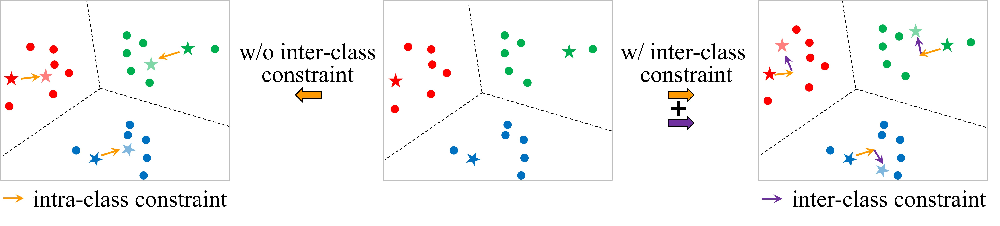
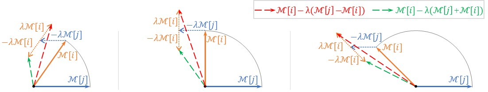
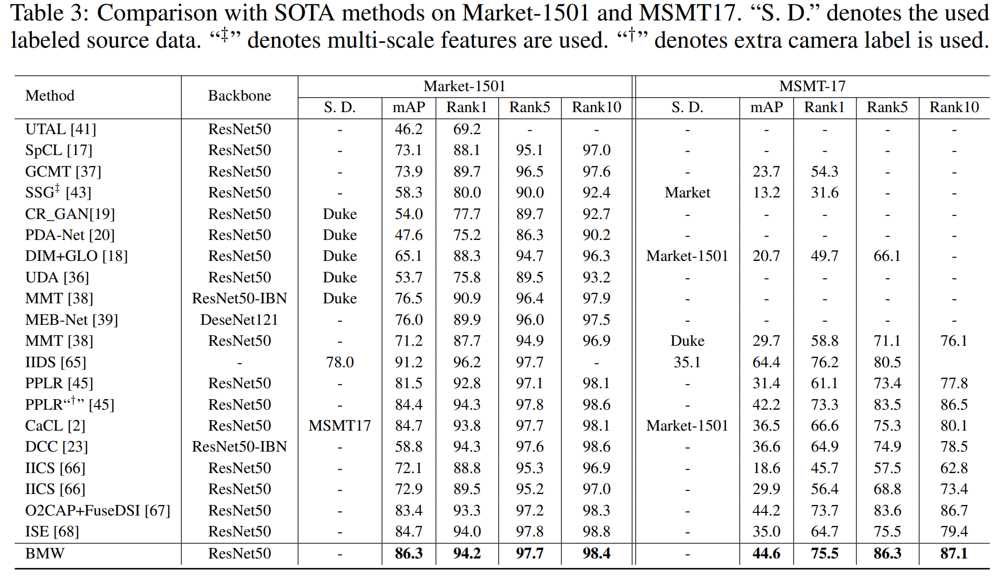
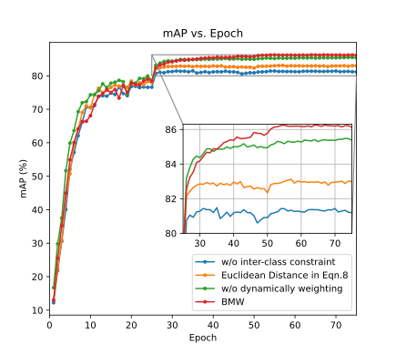

# BMW
BMW: Bidirectionally Memory bank reWriting for Unsupervised Person Re-Identification. NeurIPS 2025. \[[paper](https://neurips.cc/virtual/2025/loc/san-diego/poster/119766)\]

In this paper, we formulates the memory bank update as the gradient descent update with two objectives: reducing intra-class diversity and enhancing iner-class separability.



To effectively enhance the separability of memory banks with limited
number of rewriting steps, we further design a novel objective formulation for
the inter-class constraint, which is more effective for one step update. (Green arrows have smaller similarities with blue arrows.)


BMW achieves SOTA performance:


The proposed inter-class constraint clearly boosts the performance:



```
@inproceedings{liubmw,
  title={BMW: Bidirectionally Memory bank reWriting for Unsupervised Person Re-Identification},
  author={Liu, Xiaobin and Li, Jianing and Guo, Baiwei and Zhu, Wenbin and Yuan, Jing },
  booktitle={The Thirty-ninth Annual Conference on Neural Information Processing Systems (NeurIPS)},
  year={2025}
}
```